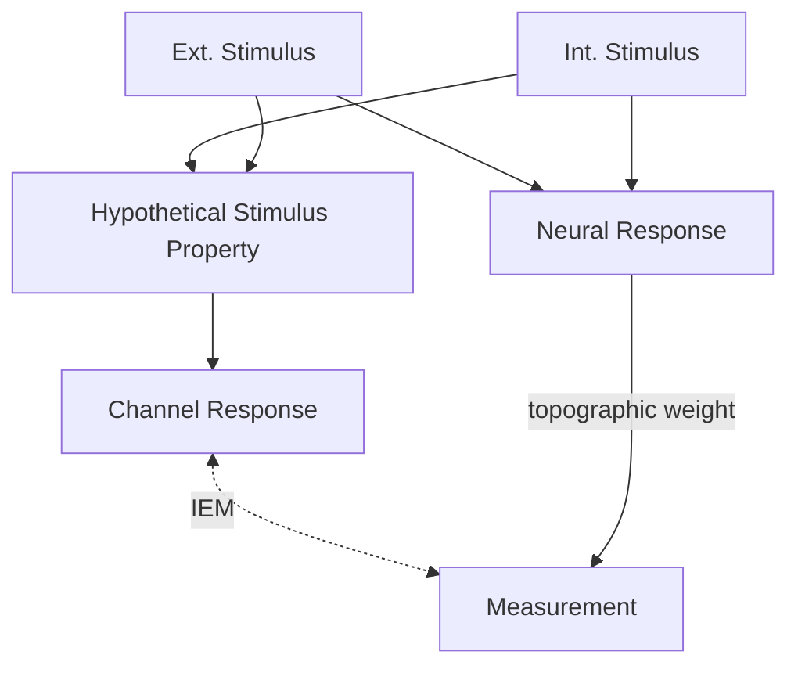

# Representational Geometry Recovery in Inverted Encoding Model

This is the representational geometry project to investigate about the recovery of *Representational Geometry* via ***Inverted Encoding Model (IEM)***.

The outline of this study is that we recreate the visual information inputs into visual cortex.
We will observe the changes in representational geometry passing through information processing units in visual cortex.

The steps are following:

1. Design the columnar organization, location array, orientation array, and the receptive field sizes array
2. Simulate the visual responses integrated to V1 information using Gabor filters in python opencv2
3. Identify the information/constructional changes along the processing steps

